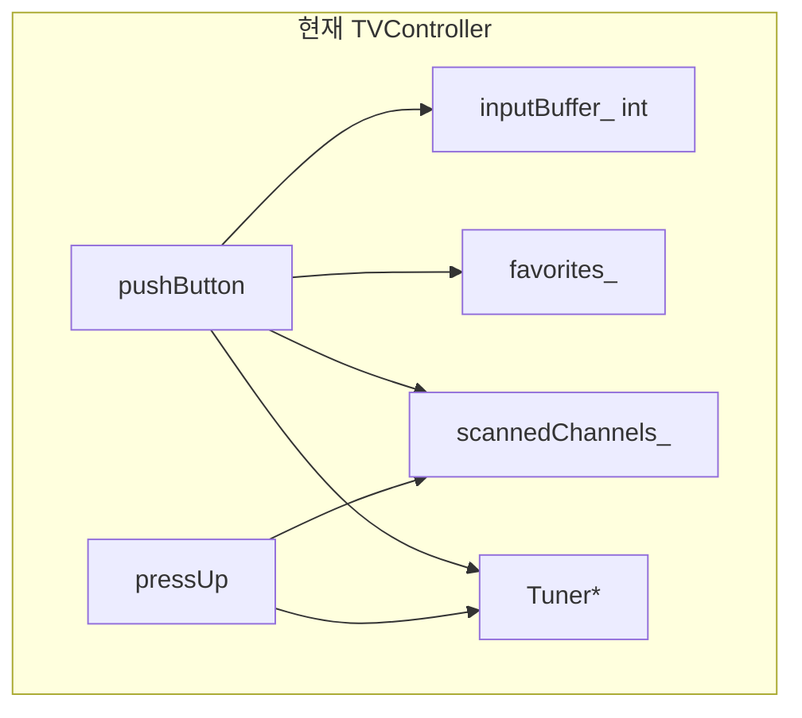
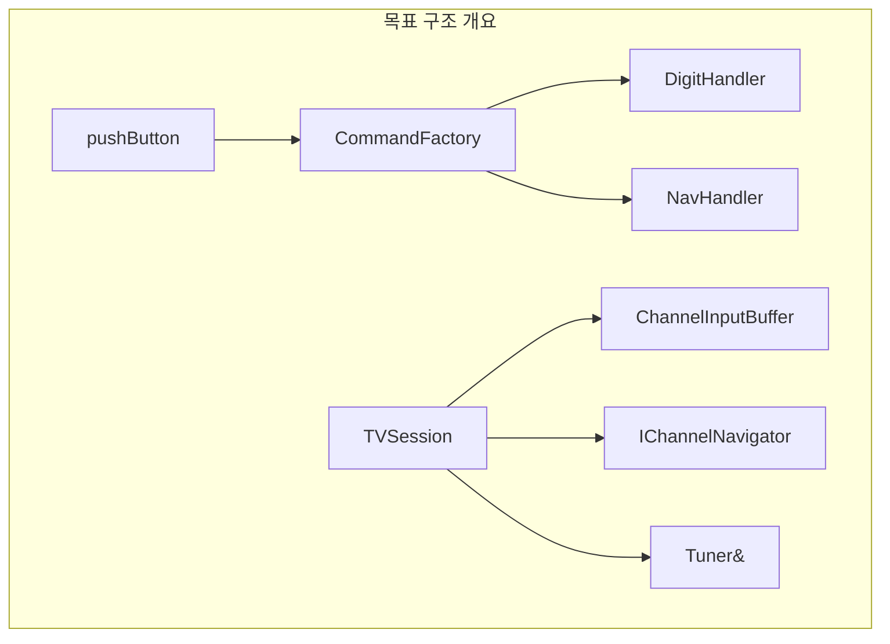

# TVController 코드 품질 분석 (SOLID / Code Smell)

**분석 대상:** `include/TVController.h`, `include/remoteKey.h`  
**관점:** SRP/OCP, Code Smell, C++17 개선, Testability  
**작성:** 시니어 C++ 아키텍트 + 모던 C++ 리뷰어

---

## 1. 요약

`TVController`는 리모컨 입력 디스패치, 2자리 채널 버퍼, 선호 채널, 채널 검색, 업/다운을 **단일 클래스·단일 public 진입점(`pushButton`)** 에서 처리합니다. `Tuner`만 가상 인터페이스로 분리되어 있어 하드웨어 의존성 테스트는 가능하지만, **입력 해석·도메인 상태·채널 네비게이션 정책**이 한 덩어리로 결합되어 SRP/OCP 위반이 뚜렷합니다. 상태는 `int inputBuffer_`(-1 센티널)와 정렬된 `vector<int>`로 표현되어 Primitive Obsession과 매직 넘버가 공존합니다.

---

## 2. 문제점 분석표

| 문제점 | 위반 원칙 / 스멜 | 영향 | 개선 방향 | 우선순위 |
|--------|------------------|------|-----------|----------|
| `pushButton`이 숫자 버퍼·OK·업/다운·검색·선호·기타 무효화를 한 메서드의 if-else 체인으로 분기 | **SRP** (단일 책임), **Long Method**, **Switch Statements** | 새 리모컨 키 추가 시 `pushButton` 수정 필수; 분기별 단위 테스트가 간접적(`pushButton` 경유) | **Command 패턴**: `remoteKey` → `std::unique_ptr<IKeyHandler>` 팩토리/맵; 핸들러별 `execute(TVContext&)` | **1** |
| 채널 직접 입력(`inputBuffer_`)과 검색/선호/업다운 네비게이션이 동일 클래스 멤버·메서드에 공존 | **SRP**, **Feature Envy** (튜너 문자열을 반복 파싱) | 한 기능 변경이 다른 기능 회귀 위험; 코드 리뷰·인지 부하 증가 | **컴포지션**: `ChannelInputBuffer`, `FavoriteStore`, `ScanResultNavigator`를 멤버로 분리하고 `TVController`는 조율만 | **1** |
| `pressUp`/`pressDown`이 `scannedChannels_.empty()` 여부로 정책 분기 | **OCP** (확장에 닫힘) | “검색 모드 / 전체 채널 / 선호만” 등 네비게이션 모드 추가 시 기존 메서드 수정 | **Strategy**: `IChannelNavigator` (`LinearNavigator`, `ScannedListNavigator`, `FavoriteNavigator`) | **2** |
| `inputBuffer_`를 `int` + `-1` 센티널로 표현 | **Primitive Obsession** | `-1` vs 채널 `0` 혼동, 2자리/1자리/무효화 규칙이 산재 | `std::optional<ChannelNumber>` 또는 `ChannelInputState` 값 객체 (빈/1자리/완료) | **2** |
| 채널 번호를 `int`·`std::string`·`stoi`로 이중 표현 | **Primitive Obsession**, **Duplicated Code** | 범위 검증 누락 지점 발생 가능; 튜너 API와 도메인 타입 불일치 | `Channel` 클래스 (0–99, `toTunerString()`, `fromTuner`) — `applyChannel`이 유일 검증 게이트 | **3** |
| `pushButton`에서 `static_cast<int>(key)`로 숫자 판별 | **타입 안전성 부족**, OCP | enum에 키 추가 시 정수 범위와 의미 불일치; `remoteKey` 순서 변경에 취약 | `isDigitKey(remoteKey)`, `visit(KeyVisitor)` 또는 `std::variant` 기반 분류 | **3** |
| `pressSearch`의 `while(true)` + `std::find` 중복 검사 | **Long Method**, 성능 스멜(매 seek마다 O(n)) | 종료 조건·튜너 복원 로직 이해 어려움; FakeTuner와 결합된 통합 테스트만 용이 | `ChannelScanner` 서비스; `std::unordered_set` 또는 정렬 유지 시 이진 탐색; 루프 조건 명시 | **4** |
| `favorites_` 토글·정렬·`upper_bound` 탐색이 컨트롤러 내부 | **SRP** | 선호 채널 정책(최대 개수, 중복) 변경 시 God Class 비대화 | `FavoriteChannelRepository` (add/remove/toggle/next) | **4** |
| `Tuner*` raw 포인터, 소유권 불명확 | **DIP 일부만 충족**, 테스트 결합 | 수명 관리 책임이 호출자; Mock 주입은 가능하나 `unique_ptr<Tuner>` 권장 | `std::unique_ptr<Tuner>` 또는 `Tuner&` + 명시적 non-owning | **5** |
| `pressOther` 등 일부 동작만 `pushButton` 외부 public | **불일관한 API** | 테스트가 public 세부 메서드에 의존(`pressFavorite` 직접 호출) | 핸들러 분리 후에도 시나리오 테스트는 `pushButton` 중심으로 통일 가능 | **5** |

---

## 3. SRP / OCP 위반 상세

### 3.1 SRP (Single Responsibility Principle)

| 책임 (현재 TVController가 수행) | 근거 코드 |
|--------------------------------|-----------|
| 리모컨 키 → 동작 라우팅 | `pushButton` (L43–71) |
| 2자리 채널 입력 버퍼 | `inputBuffer_`, 숫자 분기 (L45–52) |
| 채널 유효성·튜너 적용 | `applyChannel` (L29–34) |
| 채널 검색 수집 | `pressSearch` (L73–91) |
| 검색/비검색 업·다운 | `pressUp` / `pressDown` (L94–117) |
| 선호 채널 CRUD·순회 | `pressFavorite`, `pressNextFavorite` (L121–143) |

**한 클래스가 최소 6가지 변경 이유**를 가집니다. README/요구사항 변경 시(예: 3자리 입력, 선호 채널 상한) 서로 무관한 메서드가 같은 파일에서 동시에 수정됩니다.

### 3.2 OCP (Open-Closed Principle)

- **닫혀 있지 않음:** `remoteKey`에 새 값(예: `KEY_MUTE`)을 추가하면 `pushButton`의 else-if 체인을 수정해야 합니다.
- **닫혀 있지 않음:** 업/다운이 “검색 목록 있음/없음”만 지원; “선호 목록만 순회” 모드는 `pressUp`/`pressDown` 분기 확장이 필요합니다.
- **열려 있음 (부분):** `Tuner` 가상 인터페이스로 하드웨어/테스트 더블 교체는 OCP에 부합.

---

## 4. Code Smell 상세

### 4.1 Long Method / Switch Statements

`pushButton`은 7개 이상의 동등하지 않은 분기를 포함합니다. 실제 로직은 위임(`pressUp` 등)되지만, **입력 처리와 채널 변경 정책의 혼재**는 숫자 입력 분기(L45–52)에서 직접 `applyChannel`을 호출하는 점에서 드러납니다.

### 4.2 Primitive Obsession

| 상태 | 표현 | 리스크 |
|------|------|--------|
| 입력 버퍼 | `int inputBuffer_`, `-1` = empty | 0번 채널과 센티널 구분은 되나 의미 불명확 |
| 현재 채널 | `tuner->getCurrentCH()` → `stoi` 반복 | 파싱 실패·범위 미검증 지점 분산 |
| 선호/검색 목록 | `std::vector<int>` | 정렬 불변식이 호출자 전체에 흩어짐 (`sort` after push) |

### 4.3 기타

- **Shotgun Surgery:** 채널 범위(0–99) 변경 시 `applyChannel`, `% 100`, wrap 로직 여러 곳 수정.
- **Speculative Generality:** 주석 처리된 `keyToDigit` (L36–41) — 미사용 dead code.

---

## 5. C++17 개선 방향

### 5.1 Command 패턴 (입력 디스패치)

```cpp
struct IKeyCommand {
  virtual void execute(TVSession& session) = 0;
  virtual ~IKeyCommand() = default;
};

std::optional<std::unique_ptr<IKeyCommand>> makeCommand(remoteKey key);

void TVController::pushButton(remoteKey key) {
  if (auto cmd = makeCommand(key))
    cmd->execute(session_);
}
```

- `makeCommand`는 `std::unordered_map<remoteKey, std::function<...>>` 또는 `if constexpr` + 타입별 팩토리.
- C++17: `std::optional`, `std::variant`로 “알 수 없는 키” 표현.

### 5.2 State 패턴 (입력 모드 — 선택)

전체 TV 전원 상태까지는 과하지만, **채널 입력 FSM**에는 유효:

- `IdleState` → 숫자 → `OneDigitState` → 숫자 → `apply` / OK → `IdleState`
- `KEY_OTHER` → 모든 상태에서 `IdleState`

`std::unique_ptr<IInputState>`로 `pushButton`의 숫자 분기 제거.

### 5.3 STL 알고리즘·컨테이너

- 선호/검색: 정렬 유지가 필수면 `std::set<int>` 또는 삽입 시 `lower_bound` 위치 insert.
- `pressFavorite` 삭제: `std::erase` (C++20) 또는 현재 `remove`+`erase`를 repository 한곳으로.
- `pressSearch`: `std::unordered_set<int> seen`으로 종료 조건 O(1).

### 5.4 타입 안전 `remoteKey`

```cpp
enum class KeyCategory { Digit, Navigation, Favorite, System };

KeyCategory categorize(remoteKey key) noexcept;
```

숫자 판별에 `static_cast<int>` 대신 명시적 분류 함수 사용.

---

## 6. Testability 평가

| 항목 | 현재 | 평가 |
|------|------|------|
| `Tuner` 가상화 | `FakeTuner` / GMock 가능 (`TunerTest`) | **양호** — 하드웨어 경계 분리됨 |
| `TVController` 생성 | `TVController(Tuner*)` | **보통** — Fake 주입 가능, 소유권은 테스트 픽스처가 관리 |
| `pushButton` 단위 검증 | 시나리오 위주 (`TVControllerTest`) | **양호** — Golden path 커버 |
| 버퍼/검색/선호 **격리 테스트** | private 상태, public `press*` 혼재 | **미흡** — `pressFavorite` 직접 호출 등 API 이중성 |
| Mock 행위 검증 | `pushButton` 한 번에 여러 `setCH` | **어려움** — Command/서비스 분리 후 핸들러별 Mock 기대값 단순화 |
| 결정론적 `pressSearch` | `while(true)` + FakeTuner 채널 집합 의존 | **통합 테스트에 적합**, 단위 테스트는 Scanner 추출 후 Stub |

**결론:** FakeTuner 기반 **상태 검증**에는 최적화되어 있으나, **MockTuner 기반 행위/계약 검증**은 `TVController`가 커질수록 비용이 커집니다. SRP로 핸들러·Navigator·Scanner를 분리하면 Fake/Mock 선택이 기능별로 명확해집니다.

---

## 7. 리팩토링 우선순위 (1~5)

| 순위 | 항목 | 이유 |
|------|------|------|
| **1** | `pushButton` 분해 (Command 또는 핸들러 맵) | 변경 빈도 최고, OCP/SRP 위반의 중심; 테스트가 항상 이 진입점을 탐 |
| **2** | `ChannelInputBuffer` + `optional`/값 객체 | 버그·요구사항(무효화, 2자리)의 핵심 상태; Primitive Obsession 제거 효과 큼 |
| **3** | `Channel` 값 타입 + 튜너 경계 단일화 | `stoi`/범위 검증 중복 제거; 예외 정책 일원화 |
| **4** | `IChannelNavigator` / `ChannelScanner` 추출 | `pressUp`/`pressDown`/`pressSearch` 복잡도·회귀 위험 감소 |
| **5** | `Tuner` 소유권·API 정리 (`unique_ptr`) | 안전성·현대 C++ 관용; 동작 요구사항 변경은 적음 |

---

## 8. 개선 방향 요약

1. **조율자(Coordinator)로 축소:** `TVController`는 `Tuner`와 소형 서비스들만 연결하고, `pushButton`은 Command 디스패치 한 줄에 가깝게.
2. **도메인 타입 도입:** `Channel`, `ChannelInputState`, 정렬 invariant를 가진 `FavoriteList` / `ScannedChannelList`.
3. **정책은 Strategy:** 업/다운·다음 선호는 “현재 네비게이션 모드” 객체에 위임해 OCP 확보.
4. **테스트 전략 정렬:** 입력 버퍼·Scanner·Favorite는 Fake(상태), `setCH`/`seekCH` 시퀀스는 Mock(계약) — README Test Double 표와 동일하게 모듈 단위 매핑.
5. **점진적 TDD:** 우선순위 1–2는 기존 `TVControllerTest`를 Green 유지한 채 Extract Class; 이후 Navigator/Scanner는 미완 `UpDownWithSearchResults` 등부터 Red-Green.

---

## 9. 참고: 현재 구조 스케치





---

*본 문서는 정적 분석이며, 리팩토링 구현·테스트 실행은 포함하지 않습니다.*
