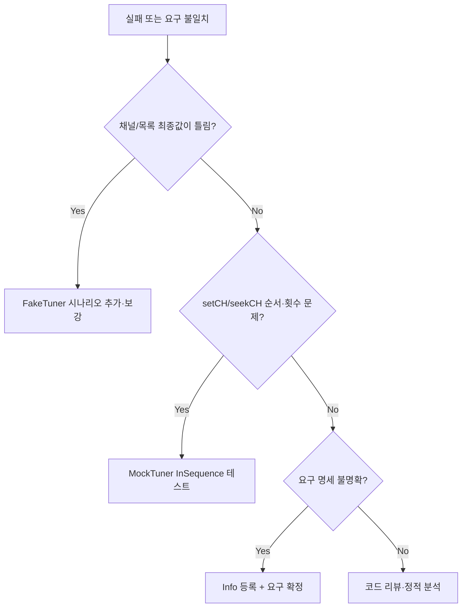

# TVController 결함 관리 보고서 (Defect Report)

| 문서 버전 | 1.0 |
|-----------|-----|
| 최종 갱신 | 2026-05-19 |
| 역할 | QA 리드 엔지니어 |
| 기준 문서 | [defect_list.md](defect_list.md), [requirements_analysis.md](requirements_analysis.md), [test_plan.md](test_plan.md) |
| 상세 결함 목록 | [defect_list.md](defect_list.md) |

본 문서는 **결함 분류 체계**, **결함 보고서 템플릿**, **품질 메트릭 수집 계획**을 정의한다. 개별 결함의 상세 필드(Steps, Expected, …)는 `defect_list.md`에 유지한다.

---

## 1. 결함 분류 체계

### 1.1 Severity 정의

| Severity | 정의 | 릴리스 영향 | 대응 SLA (권장) |
|----------|------|-------------|-----------------|
| **Critical** | 크래시, 데이터 손상, 보안·무한 루프 등 서비스 중단 | 릴리스 **차단** | 즉시 수정·핫픽스 |
| **Major** | README 핵심 요구(§1~§6) 미준수, P0 테스트 실패 | 릴리스 **차단** (예외 승인 시 연기) | 스프린트 내 수정 |
| **Minor** | 부가 시나리오·P1 경계, 우회 가능한 UX 불일치 | 다음 스프린트 | 계획 반영 |
| **Info** | 요구 미확정, 분석 후보, 문서화 이슈, 자동화 미실패 | 추적만 | 요구 확정 후 재분류 |

### 1.2 Feature 정의

| Feature (EN) | Feature (KO) | README | 대표 모듈·상태 |
|--------------|----------------|--------|----------------|
| **NumberInput** | 숫자입력 | §1 | `inputBuffer_`, `pushButton` 숫자/OK/OTHER |
| **Favorite** | 선호채널 | §2, §3 | `favorites_`, `pressFavorite`, `pressNextFavorite` |
| **Search** | 검색 | §4 | `scannedChannels_`, `pressSearch`, `Tuner::seekCH` |
| **UpDown** | Up/Down | §5, §6 | `pressUp`, `pressDown`, `scannedChannels_.empty()` 분기 |

### 1.3 Severity × Feature 매트릭스

**셀 값**: 해당 조합에 **등록된 결함 수** (Open / Fixed). `-` = 해당 Severity·Feature 조합에 등록된 결함 없음.

| Severity ↓ / Feature → | 숫자입력 (NumberInput) | 선호채널 (Favorite) | 검색 (Search) | Up/Down |
|------------------------|------------------------|---------------------|---------------|---------|
| **Critical** | - | - | - | - |
| **Major** | - | - | - | **2 Fixed** (DEF-001, DEF-002) |
| **Minor** | - | - | - | - |
| **Info** | **1 Open** (DEF-003) | - | - | - |

#### 매트릭스 해석·운영 규칙

1. **신규 결함 등록 시** 위 표의 해당 셀을 갱신하고, `defect_list.md`에 DEF-xxx 항목을 추가한다.
2. **Critical**은 현재 0건을 유지하는 것을 릴리스 게이트로 둔다 (발견 시 즉시 매트릭스·목록 동시 갱신).
3. **Up/Down × Major**는 검색 목록 존재 시 §5 로직 오적용 패턴(Controller 분기 누락)으로 집중되었음 — 회귀는 `UpDownWithSearch_OnListChannel` 등 S6 계열로 고정.
4. **NumberInput × Info**는 요구 미확정(X-OTH-02) 후보이므로, 확정 시 Severity를 Major 또는 Minor로 **재분류**한다.
5. **선호채널·검색** 열은 테스트 계획상 P0 갭(S3-4, S4-2 등)이 있으나 **자동화 실패로 등록된 결함은 아직 없음** — 탐색 테스트·요구 검토 후 발견 시 매트릭스에 반영.

#### Feature별 결함 유형 가이드 (등록 시 참고)

| Feature | Major로 올리는 전형 | Minor/Info 전형 |
|---------|----------------------|-----------------|
| 숫자입력 | 잘못된 채널 전환, 버퍼·확인 규칙 위반 | OTHER/UP/DOWN과 버퍼 상호작용 요구 불명확 |
| 선호채널 | 정렬·토글·다음 선호 wrap 오류 | 빈 목록 no-op 문서화 수준 |
| 검색 | 수집 목록·시작 채널 미복원, 무한 루프 | Mock 계약 테스트 미작성 |
| Up/Down | §5/§6 모드 분기 오류 | 단일 원소 목록 wrap 엣지 |

---

## 2. 결함 보고서 템플릿

아래 템플릿을 복사해 `defect_list.md` 또는 이슈 트래커에 붙여 넣는다. 필드명은 한·영 병기.

```markdown
## DEF-XXX

| 필드 | 내용 |
|------|------|
| **ID** | DEF-XXX |
| **Severity** | Critical / Major / Minor / Info |
| **Feature** | NumberInput / Favorite / Search / UpDown |
| **Status** | Open / In Progress / Fixed / Won't Fix / Deferred |
| **발견 단계** | Unit (Fake) / Unit (Mock) / Integration / Manual / CI |
| **Test Double** | FakeTuner / MockTuner / StubTuner / N/A |
| **관련 테스트** | `TEST_F` 이름 또는 미작성 (test_plan ID) |

### 재현 (Steps to Reproduce)

1. (전제) FakeTuner available / 초기 채널 설정
2. (동작) 키 시퀀스 또는 API 호출
3. (관측) 실패하는 assert 또는 로그

### 기대 (Expected)

- README §n / requirements_analysis / test_plan 기준의 명시적 기대값

### 실제 (Actual)

- 관측된 채널 문자열, 컬렉션, 예외, ctest 출력

### 원인 (Root Cause)

- 파일·함수·분기 (예: `pressDown()` scanned 비어 있지 않을 때 §5만 적용)

### 수정 (Fix Summary)

- 변경 요약, diff 참조, 대안 검토(해당 시)

### 검증 (Verification)

- [ ] 회귀 TEST_F Green
- [ ] `ctest` 전체 통과율 기록
- [ ] lcov 해당 분기 커버 (선택)
- [ ] 매트릭스 §1.3 셀 갱신 (Open → Fixed)
```

### 템플릿 작성 예 (요약)

| 섹션 | DEF-001 예시 |
|------|----------------|
| 재현 | 검색 `{4,6,14}`, cur=`6`, `KEY_DOWN` |
| 기대 | §6: DOWN → `"4"` |
| 실제 | `"5"` (§5 `cur-1`) |
| 원인 | `pressDown()` scanned 분기에서 `lower_bound` 미사용 |
| 수정 | 목록 내 직전 채널 + wrap |
| 검증 | `UpDownWithSearch_OnListChannel` Green, 32/32 |

---

## 3. 품질 메트릭 수집 계획

### 3.1 메트릭 개요

| 메트릭 ID | 이름 | 정의 | 수집 주기 | 목표·임계값 |
|-----------|------|------|-----------|-------------|
| **QM-01** | 테스트 통과율 | `passed / total × 100` (`ctest`) | PR마다, nightly | **100%** (P0 스위트) |
| **QM-02** | Line 커버리지 (lcov) | `TVController` 포함 컴파일 단위 line hit % | PR·스프린트 종료 | **≥ 90%** (`test_plan` §6) |
| **QM-03** | Branch 커버리지 | 분기 hit % (도구 지원 시) | 스프린트 종료 | **≥ 85%** |
| **QM-04** | 단계별 결함 발견율 | 단계별 **신규 DEF** 건수 / 해당 단계 실행 테스트 수 | 스프린트·릴리스 | 추세 관리 (§3.3) |
| **QM-05** | Open 결함 수 | Status=Open인 DEF 건수 | 일일·PR | Major/Critical **0** |
| **QM-06** | 결함 수정 리드타임 | Open → Fixed 일수 (중앙값) | 릴리스 | 팀 합의 (예: Major ≤ 3일) |
| **QM-07** | Test Double 격리 지표 | Fake vs Mock에서 **최초 발견**된 DEF 비율 | 릴리스 | §3.4 |

### 3.2 테스트 통과율 (QM-01)

**수집 방법**

```bat
cmake --build build
ctest --test-dir build --output-on-failure
```

**기록 항목**

| 필드 | 예시 |
|------|------|
| 일시 | 2026-05-19 |
| Total | 32 |
| Passed | 32 |
| Failed | 0 |
| 통과율 | 100% |
| 실패 테스트명 | (실패 시 `LastTestsFailed.log`) |

**게이트**: P0 실패 1건이라도 통과율 100% 미달 → PR merge 보류. 실패 로그를 결함 템플릿 §재현에 첨부.

### 3.3 커버리지 — lcov (QM-02, QM-03)

**파이프라인** (`test_plan` §6.2, `gen_lcov2.bat`)

```bat
cmake -B build -DCMAKE_BUILD_TYPE=Debug
cmake --build build
ctest --test-dir build --output-on-failure
gen_lcov2.bat
rem 권장: extract에 */include/* 추가 후 TVController 헤더 반영
lcov --summary lcov.info
```

| 단계 | 액션 |
|------|------|
| 베이스라인 | 현재 `TVControllerTest`만으로 `lcov.info` 생성, 미커버 라인 목록화 |
| 매핑 | 미커버 ↔ `test_plan` §2.2 TEST_F ID 1:1 |
| 보강 | P0 갭(S5, S6, S1-3/5) 테스트 추가 후 재측정 |
| 게이트 | Line **< 90%** → warning 또는 CI fail (팀 정책) |

**기록 템플릿**

```text
Date: YYYY-MM-DD
TVController line: __.__%
TVController branch: __.__% (if available)
Uncovered hot spots: pressDown(scanned), pushButton(digit2), ...
```

### 3.4 단계별 결함 발견율 (QM-04)

**테스트 단계 정의** (V-model 정렬)

| 단계 | 활동 | Test Double | 대표 산출 |
|------|------|-------------|-----------|
| **T1** | Tuner 계약 단위 | MockTuner | `TunerTest.cpp` |
| **T2** | Controller 기능 단위 | FakeTuner | `TVControllerTest.cpp` |
| **T3** | Controller 계약·시퀀스 | MockTuner | S4-3 (계획) |
| **T4** | Golden Master 회귀 | StubTuner | `ApprovalTest.cpp` |
| **T5** | 수동·요구 검토 | N/A | X-OTH-02 등 |

**발견율 계산 (스프린트)**

```text
발견율(Tk) = (해당 단계에서 최초 등록된 DEF 건수) / (해당 단계에서 실행·추가된 TEST 수) × 100%
```

**현재 스냅샷 (2026-05-19)**

| 단계 | 신규 DEF | 비고 |
|------|----------|------|
| T1 | 0 | Tuner 경계는 테스트로 차단 |
| T2 | 2 (DEF-001, 002) | Fake 기반 S6 — **Major**, Fixed |
| T3 | 0 | Mock 검색 시퀀스 테스트 미구현 |
| T4 | 0 | Approval은 스냅샷 회귀 |
| T5 | 1 (DEF-003) | **Info**, 요구 검토 — Open |

**해석**: 결함의 **다수가 T2(Fake)에서 최초 검출** → Controller 비즈니스 분기(§5/§6)가 Fake 시나리오와 잘 맞물림. T3 Mock 확대 시 **검색·Tuner 호출 순서** 결함을 T2 이전에 격리할 여지 있음.

### 3.5 Test Double별 버그 격리 효과 분석

#### 역할 요약

| Test Double | 검증 초점 | 결함 격리에 유리한 영역 | 한계 |
|-------------|-----------|-------------------------|------|
| **FakeTuner** | 최종 채널·목록 상태 | 숫자입력, 선호, 검색 수집 결과, **Up/Down §5·§6** | `setCH` 호출 횟수·순서는 약함 |
| **MockTuner** | 호출 순서·인자·횟수 | **Search** 알고리즘, `setCH("0")`→seek→복원 | 장시나리오 유지보수 비용 |
| **StubTuner** | 고정 출력 회귀 | Approval 스냅샷 | 비즈니스 규칙 신규 결함 탐지에 부적합 |

#### 프로젝트 실증 (defect_list 기준)

| 결함 | 최초 발견 Double | 격리 레이어 | Mock이 먼저 잡았을 가능성 |
|------|------------------|-------------|---------------------------|
| DEF-001, 002 | **Fake** (결과 채널 assert) | Controller `pressUp`/`pressDown` | 낮음 — Mock은 Tuner 호출은 맞아도 **채널 결과** 오류를 놓칠 수 있음 |
| DEF-003 | **요구 분석** (T5) | `pushButton` 라우팅 | 중간 — UP/DOWN이 `pressOther` 미경유는 **행위 시퀀스** Mock으로도 설계 가능 |

#### 격리 효과 지표 (릴리스마다 기록)

```text
Fake_first  = DEF 중 발견 단계 T2 비율
Mock_first  = DEF 중 발견 단계 T3 비율
Manual_first = DEF 중 발견 단계 T5 비율

격리 효과 (정성):
- Fake_first 높음 → Controller 상태·분기 품질은 Fake로 충분히 방어 가능
- Mock_first 증가 → Tuner 계약·검색 루프를 Mock으로 전진 배치한 효과
- Manual_first 높음 → 자동화 갭; test_plan P1/P2 및 X-* 케이스 테스트화 필요
```

**권장 조합** (`requirements_analysis` §4)

- **P0 회귀**: Fake + `ctest` 통과율 (QM-01)
- **검색·계약**: Mock + `InSequence` (QM-04 T3에서 결함 조기 발견)
- **릴리스 스냅샷**: Stub Approval (회귀만, 신규 로직 결함 탐지 아님)

#### 버그 격리 의사결정 트리



### 3.6 메트릭 대시보드·보고 주기

| 주기 | 수집 메트릭 | 산출물 |
|------|-------------|--------|
| PR | QM-01, Open 수(QM-05) | CI 로그, PR 코멘트 |
| 스프린트 종료 | QM-02~04, QM-07 | 스프린트 QA 요약 (본 문서 §1.3 매트릭스 갱신) |
| 릴리스 | QM-06, 전체 DEF 목록 | `defect_list.md` 버전 태그 |

### 3.7 추적성

| 문서 | 역할 |
|------|------|
| [test_plan.md](test_plan.md) | TEST_F·P0/P1, 커버리지 목표, X-OTH-02 |
| [defect_list.md](defect_list.md) | DEF-xxx 상세 (템플릿 인스턴스) |
| [requirements_analysis.md](requirements_analysis.md) | Feature·Test Double·시나리오 ID |
| `Report\006_tv_controller_debug_report.md` | DEF-001/002 분석·diff |
| `gen_lcov2.bat` | QM-02 수집 스크립트 |

---

## 4. 문서 유지보수

1. **신규 결함**: §2 템플릿으로 `defect_list.md`에 등록 → §1.3 매트릭스 셀 갱신.
2. **Severity/Feature 변경**: 재분류 사유를 DEF 항목에 한 줄 기록.
3. **스프린트 종료**: QM-01~04, §3.5 격리 지표를 스프린트 보고서에 복사.
4. **릴리스 게이트**: Critical=0, Major Open=0, QM-01=100%, QM-02≥90% (extract `include` 반영 후).

---

*문서 버전 1.0 — `defect_list.md` v1.0 및 `test_plan.md` (2026-05-19)와 동기화*
