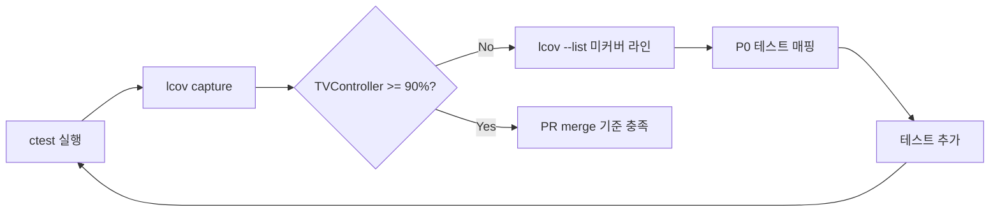

# TDD_TV 테스트 계획서 (TVController)

> **역할**: 시니어 QA 리드  
> **기준 문서**: [README.md](../README.md), [requirements_analysis.md](requirements_analysis.md)  
> **대상**: `TVController` (`include/TVController.h`), `TEST_F(TVControllerTest, …)`  
> **스택**: C++17, Google Test, GMock, CMake, gcov/lcov  
> **문서 버전**: 2026-05-19

---

## 1. 목적·범위

| 항목 | 내용 |
|------|------|
| **목적** | README 요구사항을 `TVController` 단위 테스트로 검증 가능하게 분해하고, 우선순위·경계·Test Double·커버리지 전략을 팀 합의 기준으로 고정 |
| **In Scope** | `TVController` public API 및 `pushButton` 진입점, `applyChannel` 예외, 내부 상태(`inputBuffer_`, `favorites_`, `scannedChannels_`)의 관측 가능 결과 |
| **Out of Scope** | 실제 `Tuner` 하드웨어/벤더 구현(계약은 `TunerTest` + Mock으로 분리), UI·리모컨 센서 드라이버 |
| **테스트 스위트** | `test/TVControllerTest.cpp` (Fixture: `FakeTuner`), 보조: `test/TunerTest.cpp` (MockTuner), `test/ApprovalTest.cpp` (회귀) |

---

## 2. TEST_F 단위 테스트 범위 및 우선순위

### 2.1 Fixture 공통

```cpp
class TVControllerTest : public ::testing::Test {
  // 기본: FakeTuner({1, 4, 12, 56}), TVController 주입
};
```

| 우선순위 | 의미 | 실행 시점 |
|----------|------|-----------|
| **P0** | README 핵심·릴리스 차단 | PR마다 CI 전체 |
| **P1** | 경계·wrap·검색 모드 분기 | PR + nightly |
| **P2** | 회귀·Approval·Mock 계약 보강 | 주 1회 / 커버리지 갭 해소 시 |

### 2.2 기능별 TEST_F 매트릭스

| ID | TEST_F (권장 이름) | README | 우선순위 | 구현 상태 | 검증 포인트 |
|----|-------------------|--------|----------|-----------|-------------|
| **S1-1** | `PressNumber4ThenConfirm` | §1 한 자리+확인 | P0 | ✅ | `KEY_4` → `KEY_OK` → `getCurrentCH()=="4"` |
| **S1-2** | `Press1Then2_AutoChange` | §1 두 자리 즉시 | P0 | ✅ | `1`,`2` → `"12"`, 버퍼 비움 |
| **S1-3** | `PressFourDigits_12Then34` | §1 네 자리 연속 | P0 | ❌ | `1,2,3,4` → `"12"` 후 `"34"` |
| **S1-4a** | `ThreeDigits_45ThenBuffer6` | §1 `4,5,6` | P0 | ⚠️ 부분 | `4,5` → `"45"`; `6` 후 채널 유지·버퍼만 6 |
| **S1-4b** | `Buffer6ThenOk_GoesTo6` | §1 `6`+확인 | P0 | ❌ | `4,5,6,OK` → `"6"` |
| **S1-4c** | `OtherButtonCancelsBuffer` | §1 기타 무효화 | P0 | ✅ | `OTHER` 후 `"45"` 유지 |
| **S1-4d** | `OtherButtonCancelsNumberBuffer` | §1 무효화 후 OK | P0 | ✅ | `OTHER` 후 `OK` → 채널 변화 없음 |
| **S1-5** | `Press0Then7_ChangesTo7` | §1 `0`,`7` | P0 | ❌ | `"7"` (선행 0 두 자리 조합) |
| **S1-6** | `Press1ThenConfirm` | §1 `1`+확인 | P1 | ❌ | `"1"` |
| **S2-1** | `FavoriteAdd_NewChannel` | §2 추가 | P0 | ✅ | 비선호 → 목록 포함 |
| **S2-2** | `FavoriteToggle_Remove` | §2 삭제 | P0 | ✅ | 토글 제거 |
| **S2-3** | `FavoriteToggleScenario` | §2 정렬 | P0 | ✅ | `{6,12,37}` 정렬 |
| **S3-1** | `NextFavorite_Normal` | §3 cur=6→12 | P0 | ✅ | `upper_bound` 동작 |
| **S3-2** | `NextFavorite_From4To12` | §3 중간값 | P1 | ❌ | cur=4 → `"12"` |
| **S3-3** | `NextFavorite_WrapAround` | §3 wrap | P0 | ✅ | cur=56 → `"1"` |
| **S3-4** | `NextFavorite_EmptyList_NoOp` | §3 빈 목록 | P1 | ❌ | `setCH` 호출 없음·채널 유지 |
| **S4-1** | `SearchAndRestoreOriginalChannel` | §4 검색·복원 | P0 | ✅ | `scanned`={1,4,12,56}, 시청 채널 복원 |
| **S4-2** | `Search_DoesNotChangeViewingUntilDone` | §4 | P1 | ❌ | 검색 중/후 시작 채널 동일 (Mock 시퀀스) |
| **S4-3** | `Search_MockCallSequence` | §4 계약 | P1 | ❌ | `setCH("0")` → N×`seekCH` → `setCH(start)` |
| **S5-1** | `UpDown_NoSearch_From6` | §5 일반 | P0 | ❌ | UP→7, DOWN→5 |
| **S5-2** | `UpDown_NoSearch_Wrap99To0` | §5 99→0 | P0 | ❌ | cur=99, UP → `"0"` |
| **S5-3** | `UpDown_NoSearch_Wrap0To99` | §5 0→99 | P0 | ❌ | cur=0, DOWN → `"99"` |
| **S6-1** | `UpDown_WithSearch_6Up14Down4` | §6 목록 내 | P0 | ❌ | scanned={4,6,14}, cur=6 |
| **S6-2** | `UpDown_WithSearch_OutOfList15` | §6 wrap | P0 | ❌ | cur=15, UP→4, DOWN→14 |
| **S6-3** | `UpDown_WithSearch_SingleChannel` | §6 단일 | P1 | ❌ | scanned={8}, UP/DOWN wrap |
| **E-1** | `InvalidChannelThrows` | 경계 | P0 | ✅ | `applyChannel(-1|100)` 예외 |
| **E-2** | `ApplyChannel_Boundary99` | 경계 | P1 | ❌ | `9`,`9` → `"99"` |
| **E-3** | `ApplyChannel_InvalidViaDigits` | 경계 | P2 | ❌ | `9`,`0` → 90 유효; `1`,`0`,`0` 패턴은 2자리 단위로만 완성 |

**범례**: ✅ 구현됨 · ⚠️ 시나리오 일부만 검증 · ❌ 미구현·스켈레톤

### 2.3 우선순위 실행 순서 (권장 스프린트)

1. **스프린트 1 (P0 갭)**: S1-3, S1-4a/b, S1-5, S5-1~3, S6-1~2, `UpDownWithSearchResults` 완성  
2. **스프린트 2 (P1)**: S3-2, S3-4, S4-2~3(Mock), S6-3, E-2  
3. **스프린트 3 (P2·회귀)**: Approval Fake 기반 확장, 파라미터화 경계

### 2.4 직접 API vs `pushButton` 진입

| API | 테스트 방식 | 비고 |
|-----|-------------|------|
| `pushButton` | 사용자 시나리오 대부분 | 숫자·OK·OTHER·UP/DOWN·SEARCH |
| `pressFavorite`, `pressNextFavorite`, `pressUp`, `pressDown`, `pressSearch` | 상태 준비 후 단계 검증 허용 | Fixture에서 `tuner->setCH` 후 호출 (기존 패턴 유지) |
| `applyChannel` | 예외·경계 단위 | E-1, E-2 |
| `getFavoriteChannels`, `getScannedChannels` | 결과 컬렉션 assert | Fake 기반 |

---

## 3. 경계값 케이스 목록

### 3.1 채널 번호 (0~99)

| 케이스 ID | 입력/전제 | 기대 결과 | TEST_F |
|-----------|-----------|-----------|--------|
| B-CH-01 | `applyChannel(0)` | `setCH("0")` 성공 | (직접 또는 `0`+OK) |
| B-CH-02 | `applyChannel(99)` | 성공 | `9`,`9` 또는 직접 |
| B-CH-03 | `applyChannel(100)`, `(-1)` | `std::invalid_argument` | `InvalidChannelThrows` |
| B-CH-04 | cur=**99**, UP (검색 없음) | **0** (mod 100) | `UpDown_NoSearch_Wrap99To0` |
| B-CH-05 | cur=**0**, DOWN (검색 없음) | **99** | `UpDown_NoSearch_Wrap0To99` |
| B-CH-06 | cur=6, UP/DOWN (검색 없음) | 7 / 5 | `UpDown_NoSearch_From6` |
| B-CH-07 | `0`,`7` 연속 숫자 | 채널 **7** (버퍼 0→7 즉시 적용) | `Press0Then7_ChangesTo7` |

### 3.2 빈 선호 채널 (`favorites_.empty()`)

| 케이스 ID | 전제 | 동작 | 기대 |
|-----------|------|------|------|
| B-FAV-01 | 선호 목록 없음 | `KEY_NEXT_FAV` / `pressNextFavorite()` | **no-op**, `getCurrentCH()` 불변 |
| B-FAV-02 | 생성 직후 | `getFavoriteChannels().empty()` | true |
| B-FAV-03 | 마지막 항목 토글 삭제 후 | `KEY_NEXT_FAV` | B-FAV-01과 동일 |

### 3.3 검색 목록 없음 (`scannedChannels_.empty()`)

| 케이스 ID | 전제 | UP/DOWN 규칙 | 비고 |
|-----------|------|--------------|------|
| B-SCN-01 | 검색 미실행 또는 `pressSearch` 전 | `(cur±1)` with wrap B-CH-04/05 | S5 시리즈 |
| B-SCN-02 | 검색 후 목록 clear 없음(현재 구현은 clear 후 재수집) | 검색 **전** 빈 목록으로 S5 적용 | `Search` 테스트와 S5 분리 Fixture |

### 3.4 검색 목록 있을 때 Up/Down

| 케이스 ID | `scannedChannels_` | cur | UP | DOWN |
|-----------|-------------------|-----|-----|------|
| B-SCN-10 | {4,6,14} | 6 | 14 | 4 |
| B-SCN-11 | {4,6,14} | **15** (목록 외) | **4** (wrap front) | **14** (wrap back) |
| B-SCN-12 | {8} | 8 | 8 | 8 (단일 원소 wrap) |
| B-SCN-13 | {4,6,14} | 4 | 6 | 14 (lower_bound at begin → back) |

**Fixture 주의**: 기본 `FakeTuner({1,4,12,56})`는 README §6 예시 `{4,6,14}`와 다름. S6 테스트는 **전용 Fixture** 또는 검색 전 `FakeTuner` available 목록을 `{4,6,14}`로 재구성.

---

## 4. 예외·특이 케이스 목록

### 4.1 연속 숫자 입력 중 OTHER 키 무효화 (README §1, S1-4)

| 단계 | 키 | `inputBuffer_` | 채널 | 설명 |
|------|-----|----------------|------|------|
| 1 | `4` | 4 | - | 첫 자리 |
| 2 | `5` | -1 | 45 | 두 자리 완성 → 즉시 적용 |
| 3 | `6` | 6 | 45 | 한 자리 버퍼 |
| 4 | **OTHER** | **-1** | 45 | `pressOther()` — **무효화** |
| 5 | OK | -1 | 45 | 버퍼 없음 → 변화 없음 |

**TEST_F**: `OtherButtonCancelsBuffer`, `OtherButtonCancelsNumberBuffer` (P0, 구현 완료)

**추가 특이 (P1)**:

| 케이스 ID | 시퀀스 | 기대 |
|-----------|--------|------|
| X-OTH-01 | `1` → OTHER → `2` | `"1"`만 확정되지 않음; OTHER 후 `2`만으로는 `"2"` (버퍼 새로 시작) |
| X-OTH-02 | `6` 버퍼 상태에서 UP/DOWN/SEARCH/FAV | OTHER와 동일하게 버퍼만 클리어 여부 확인 — **현재 구현**: 숫자·OK·업다운·검색·선호 외는 `pressOther()` (UP/DOWN은 버퍼 유지 안 함 → `pressUp`/`pressDown` 직접 호출, `pushButton` 경유 시 업다운은 버퍼 무효화 **아님**) |

> **구현 메모**: `pushButton`에서 `KEY_UP`/`KEY_DOWN`은 `pressOther()`를 거치지 않음. 버퍼 `6` 상태에서 UP을 누르면 채널만 변경되고 버퍼는 코드상 유지될 수 있음 — 요구와 불일치 시 **결함 등록** 후 테스트로 고정.

### 4.2 `0` → `7` 입력 (README §1)

| 케이스 ID | 시퀀스 | 계산 | 기대 채널 |
|-----------|--------|------|-----------|
| X-DIG-01 | `KEY_0`, `KEY_7` | `0*10+7=7` | `"7"` |
| X-DIG-02 | `KEY_0`, `KEY_OK` | 단일 버퍼 0 | `"0"` |
| X-DIG-03 | `KEY_0`, `KEY_9` | 09→9 | `"9"` (유효) |
| X-DIG-04 | `KEY_9`, `KEY_9` | 99 | `"99"` (상한 경계) |

### 4.3 예외 (`applyChannel`)

| 케이스 ID | 조건 | 예외 |
|-----------|------|------|
| X-EX-01 | ch &lt; 0 | `std::invalid_argument` ("Invalid ch") |
| X-EX-02 | ch &gt; 99 | 동일 |
| X-EX-03 | 두 자리 키만으로는 100 불가 | 키 0~9만 — 100은 `applyChannel` 직접 호출로만 검증 |

### 4.4 다음 선호·검색 알고리즘 특이

| 케이스 ID | 조건 | 기대 |
|-----------|------|------|
| X-FAV-01 | cur=12, favorites에 12 포함 | 다음 선호 시 **12 제외**, greater 중 최소 |
| X-SRH-01 | `seekCH`가 이미 수집된 채널 반환 | 루프 종료, 무한 루프 없음 |
| X-SRH-02 | 검색 완료 후 | `getCurrentCH()` == 검색 시작 채널 문자열 |

---

## 5. Test Double 활용 계획

### 5.1 역할 분담

| Test Double | 파일 | 검증 스타일 | 사용 기능 |
|-------------|------|-------------|-----------|
| **FakeTuner** | `test/FakeTuner.h` | **상태 기반** — `current_`, `available_`, `getCurrentCH()`, 목록 기반 `seekCH` | 숫자 입력 최종 채널, 선호 토글·다음 선호, 검색 수집 결과, 일반/검색 모드 UP/DOWN, wrap |
| **MockTuner** | `test/TunerTest.cpp` (패턴) | **행위 기반** — `EXPECT_CALL`, `InSequence`, `Times` | `pressSearch()` 호출 순서, `setCH` 인자 문자열, `seekCH` 반복 횟수, Controller가 Tuner에 위임하는 계약 |
| **StubTuner** | Approval 테스트 | 고정 반환 | Golden Master 회귀; 비즈니스 규칙 전체 검증에는 부적합 |

### 5.2 FakeTuner — 언제 쓰는가

- **채널 상태 assert**가 목적일 때: `EXPECT_EQ("12", tuner->getCurrentCH())`
- **검색 결과** assert: `getScannedChannels()` vs `FakeTuner`의 `available_` 정렬 집합
- **시나리오 데이터 변경**만으로 테스트 재사용: ctor에 `vector<int>{4,6,14}` 전달

```cpp
// 예: S6 전용 SetUp
tuner = std::make_unique<FakeTuner>(std::vector<int>{4, 6, 14});
tuner->setCH("6");
ctrl->pushButton(remoteKey::KEY_SEARCH); // 또는 scanned 주입 헬퍼(테스트 전용)
```

### 5.3 MockTuner — 언제 쓰는가

- **호출 횟수·순서**가 결함 포인트일 때 (검색 알고리즘):
  1. `getCurrentCH()` → `"12"`
  2. `setCH("0")`
  3. `seekCH()` × N (반환값 시퀀스: 중복 시 종료)
  4. `setCH("12")` 복원
- **`applyChannel`이 `setCH(std::to_string(ch))`를 정확히 1회 호출**하는지 (선택적 P1)
- **Tuner 경계**는 `TVController`가 아닌 `TunerTest`에 유지 (유효/무효 `setCH` 파라미터화)

### 5.4 혼용 금지·권장

| 하지 말 것 | 대신 |
|------------|------|
| 20단계 리모컨 시나리오 전체를 Mock만으로 구성 | Fake + 최종 상태 assert |
| Fake로 `setCH` 3회 호출 여부만 검증 | Mock + `Times(3)` |
| TVControllerTest에서 실제 `Tuner` 구현체 링크 | DI로 Fake/Mock만 |

### 5.5 신규 테스트 파일 (선택)

| 파일 | 내용 |
|------|------|
| `test/TVControllerSearchMockTest.cpp` | S4-3 전용, `MockTuner`, GMock `InSequence` |
| `test/TVControllerTest.cpp` | 기존 유지, Fake 중심 P0/P1 |

---

## 6. 커버리지 목표 및 gcov/lcov 전략

### 6.1 목표

| 대상 | Line | Branch | 비고 |
|------|------|--------|------|
| `TVController` (`include/TVController.h`) | **≥ 90%** | **≥ 85%** (도구 지원 시) | 프로덕션 로직 집중 |
| `test/*` (Fake 등) | 측정 포함·목표 없음 | — | `gen_lcov2.bat` extract 범위 |
| 전체 프로젝트 | ≥ 80% | — | Approval·TunerTest 포함 시 |

**미달 시**: P0 테스트(S5, S6, S1-3/5) 추가 → 재측정 → 미커버 라인 리스트 기반 1건씩 보강.

### 6.2 측정 파이프라인 (저장소 기준)

프로젝트는 `CMakeLists.txt`에 `--coverage`가 이미 설정됨.

```bat
rem 1) 빌드·테스트
cmake -B build -DCMAKE_BUILD_TYPE=Debug
cmake --build build
ctest --test-dir build --output-on-failure

rem 2) lcov 수집 (gen_lcov2.bat)
gen_lcov2.bat

rem 3) HTML 리포트 (환경에 genhtml 설치 시)
genhtml lcov.info -o build/coverage_html
```

`gen_lcov2.bat` 동작:

- `lcov --capture` (build 디렉터리 `.gcda`)
- `lcov --extract` → `*/src/*`, `*/test/*`  
  - **주의**: 현재 `src/` 없음. `TVController`는 **헤더-on리**로 `TVControllerTest` 컴파일 단위에 포함되어 측정됨. extract 패턴에 `*/include/*` 추가를 권장 (커버리지 누락 방지).

### 6.3 개선 전략 (측정 → 분석 → 보강)



| 단계 | 액션 |
|------|------|
| 1. 베이스라인 | 현재 `TVControllerTest`만으로 lcov 리포트 생성, 미커버 분기 목록화 (`pressDown` scanned 분기, `pushButton` else 등) |
| 2. P0 매핑 | 미커버 라인 ↔ §2.2 표 ID 1:1 매핑 |
| 3. 분기 커버리지 | `scannedChannels_.empty()` true/false 각각 S5·S6에서 강제 |
| 4. 예외 경로 | E-1 + 유효 99 경계로 `applyChannel` if 양쪽 |
| 5. 회귀 게이트 | CI에서 `lcov --summary` 파싱, 90% 미만 시 warning (또는 실패) |
| 6. extract 수정 | `gen_lcov2.bat`에 `"*/include/*"` 추가 후 재측정 |

### 6.4 커버리지와 테스트 우선순위 연계

| 미커버 예상 구간 | 대응 TEST_F |
|------------------|-------------|
| `pressUp` / `pressDown` non-empty `scannedChannels_` | S6-1, S6-2, S6-3 |
| `pressUp` / `pressDown` empty branch | S5-1~3 |
| `pushButton` digit 두 번째 분기 | S1-3, S1-5 |
| `pressNextFavorite` empty return | S3-4 |
| `pressSearch` while 루프 | S4-1, S4-3 |

---

## 7. 테스트 데이터·Fixture 가이드

| 시나리오 | FakeTuner `available_` | 초기 `setCH` |
|----------|------------------------|--------------|
| 기본 선호·검색 | {1, 4, 12, 56} | (ctor 첫 채널 1) |
| README §6 UP/DOWN | {4, 6, 14} | 6 또는 15 |
| Wrap 0/99 | 임의 단일 채널 가능 | `"99"` / `"0"` |
| 빈 선호 | 동일 | 임의 |
| 검색 루프 종료 | 2개 이상 + 순환 | `seekCH`가 available 순회 |

---

## 8. 완료 기준 (Exit Criteria)

- [ ] P0 TEST_F 전부 Green (`ctest` 100% pass)
- [ ] README §1~§6 각 항목 최소 1개 이상 TEST_F 추적 가능
- [ ] 경계 §3 전 케이스 ID 매핑 테스트 존재
- [ ] `TVController` line coverage **≥ 90%** (lcov, include 경로 extract 반영 후)
- [ ] `UpDownWithSearchResults` 스켈레톤 제거·S6-1/2 구현
- [ ] 결함 후보(X-OTH-02) 요구사항 대비 구현 검토·문서화

---

## 9. 추적성 매트릭스 (요약)

| README | 테스트 계획 ID | 우선순위 |
|--------|---------------|----------|
| §1 숫자·버퍼 | S1-1 ~ S1-6, X-DIG, X-OTH | P0 |
| §2 선호 | S2-1 ~ S2-3 | P0 |
| §3 다음 선호 | S3-1 ~ S3-4, B-FAV | P0~P1 |
| §4 검색 | S4-1 ~ S4-3, X-SRH | P0~P1 |
| §5 UP/DOWN (일반) | S5-1 ~ S5-3, B-CH-04/05 | P0 |
| §6 UP/DOWN (검색) | S6-1 ~ S6-3, B-SCN-10~13 | P0 |

---

*본 계획서는 `test/TVControllerTest.cpp` 현행 구현(2026-05-19)과 `docs/requirements_analysis.md` §5 시나리오 목록을 동기화하였다.*
